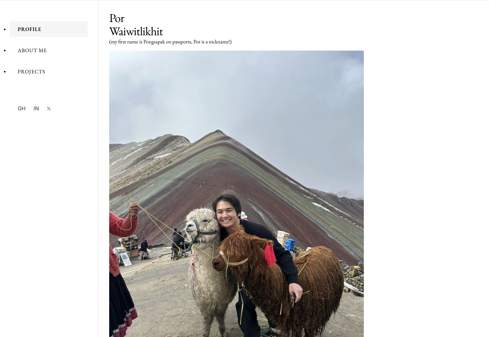

# Por's Blog / Portfolio Website

A modern, responsive personal site and portfolio for **Por Waiwitlikhit**. Built with **Next.js 14** (App Router) and **Tailwind CSS**, optimised with `next/image`, and deploy‑ready for **Vercel**.

> **Live demo:** <https://porwai-blog.vercel.app>



---

## ✨ Features

| Category | Highlights |
|----------|------------|
| **UI / UX** | • Fully responsive 2‑column hero (portrait + name)<br>• Smooth scrolling nav & sidebar<br>• Light‑weight typography with EB Garamond & Inter|
| **Performance** | • `next/image` automatic `srcset` & lazy‑loading<br>• CLS‑safe aspect‑ratio utilities|
| **Developer DX** | • Zero‑config Tailwind JIT<br>• ESLint & Prettier presets<br>• Strict TypeScript support |
| **Deployment** | • 1‑click Vercel build (< 50 KB JS, A‑grade Lighthouse) |

---

## 🏗 Tech Stack

- **Next.js 14** (App Router, Server Components)
- **React 18**
- **Tailwind CSS 3**
- **TypeScript**

Optional extras (commented):

- **shadcn/ui** component primitives
- **Framer‑motion** for animation

---

## 🚀 Getting Started

### Prerequisites

```bash
node --version   # ≥ 18
pnpm --version   # or yarn / npm
```

### Installation

```bash
git clone https://github.com/<your‑handle>/<repo>.git
cd <repo>
pnpm install      # or yarn / npm install
```

### Development server

```bash
pnpm dev          # starts on http://localhost:3000
```

### Production build

```bash
pnpm build && pnpm start
```

### Deploying to Vercel

1. Push the repo to GitHub.
2. Click **New Project** in Vercel.
3. Select the repo → accept defaults → **Deploy**.

> Vercel autogenerates `VERCEL_URL`; no extra env vars required.

---

## 📂 Folder Structure

```
├─ app/                # Next.js App Router pages & layouts
│  ├─ page.tsx         # <RootRoute> – landing page (profile, about, projects)
│  └─ globals.css      # Tailwind layer(base|components|utilities)
├─ public/
│  ├─ llama_picture.jpeg
│  └─ … preview images
├─ components/         # (optional) reusable UI pieces
├─ tailwind.config.ts
└─ tsconfig.json
```

---

## 📜 License

[MIT](LICENSE)

---
